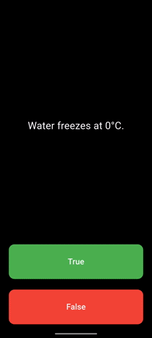

# 📱 Flutter Learning Projects

Мої навчальні проєкти під час вивчення Flutter.

---

## Quizzler App

Перший додаток — вивчення state, кнопок та віджетів, ООП в Dart/Flutter.

**Що використано:**

* StatefulWidget
* setState
* Material UI
* AwesomeDialog

---
